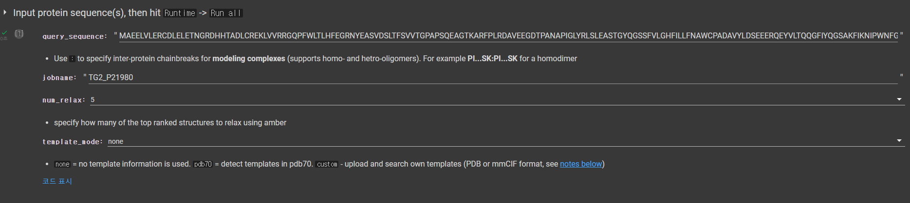
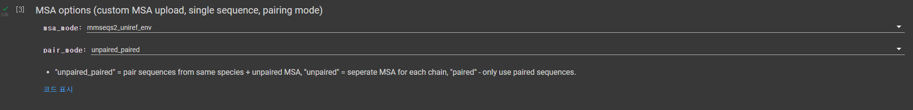
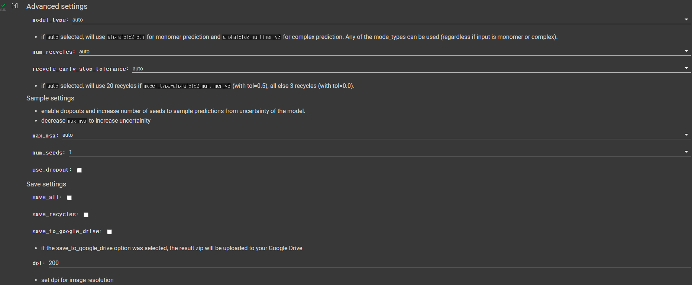
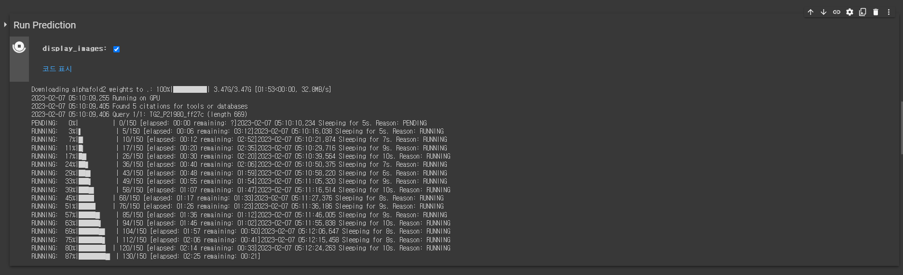

# AlphaFold2
Deepmind

---

# ColabFold

- Google Colab 의 Cloud 서버를 이용해서 Alphafold를 사용.
- deepmid에서 Colab platform을 이용하여 AlphaFold2 script 및 사용법 upload
- Google 서버(GPU)를 사용하여 AlphaFold2 실행 및 결과 확인

[Colab AlphaFold2](https://colab.research.google.com/github/sokrypton/ColabFold/blob/main/AlphaFold2.ipynb#scrollTo=kOblAo-xetgx)

---

### 1. input protein sequence
protein sequence (in uniprot)
jobname
templete_mode : none

---

### 2. Install dependencies

---

### 3. MSA options (custom MSA upload, single sequence, pairing mode)
mmseqs2_uniref_env (Default)
unpaired_paired (Default)

---
### 4. Advanced settings
model_type : auto (Default)
num_recycles : auto (Default)

---

### 5. Run Prediction
5 model output (대략적인 model)

---

### 6. Display 3D structure
check 3D structure (choose rank_num (1~5))
show_sidechain
color : lDDT, rainbow
exacted prediction : blue
weak prediction : green
### 7. Plots
Sequence coverage
Predicted lDDT per position : 100점에 가까우면 정확한 예측에 가깝다.
### 8. Package and download results

## Summary
protein sequence -> predicted 5 structure